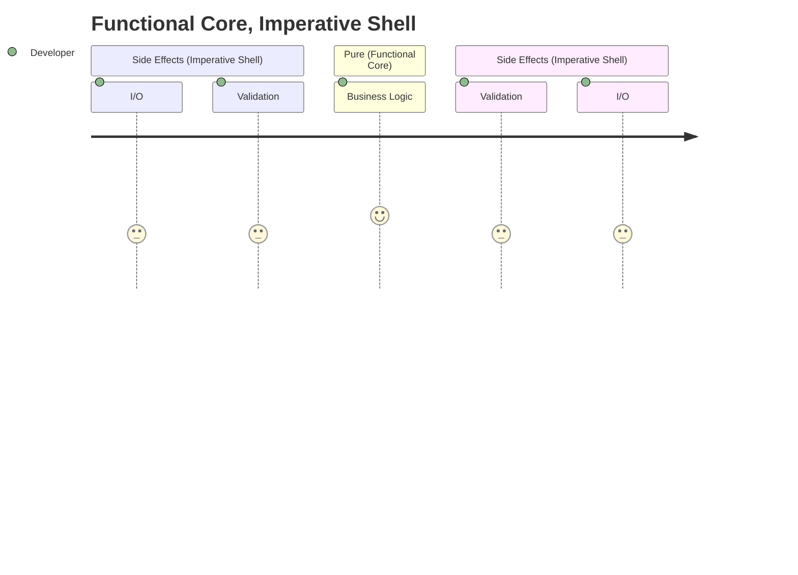

# Inbox

## `pandoc`

Convert a `docx` file to `md`:

```powershell
&pandoc `
 --verbose `
 --from docx `
 --to markdown `
 --default-image-extension=png `
 --extract-media=images `
 'document.docx' -o document.md
```

## Code Design

### Functional Core, Imperative Shell

- [Functional Core, Imperative Shell (destroyallsoftware.com)](https://www.destroyallsoftware.com/screencasts/catalog/functional-core-imperative-shell)
- [Robert C Martin - Functional Programming; What? Why? When? (youtube.com)](https://www.youtube.com/watch?v=7Zlp9rKHGD4)
- [Moving IO to the edges of your app: Functional Core, Imperative Shell - Scott Wlaschin (youtube.com)](https://www.youtube.com/watch?v=P1vES9AgfC4)



## Jenkins Snippets

```groovy
// This was the only script that allowed me to see the zombie job
jenkins.model.Jenkins.instance.computers.collect { c -> c.executors }.collectMany { it.findAll { it.isBusy () } }.each { it -> println(it.getName()); }

//Try to stop it but didnt work
jenkins.model.Jenkins.instance.computers.collect { c -> c.executors }.collectMany { it.findAll { it.isBusy () } }.each { it.stop () }
```

```groovy
Jenkins.instance.getItemByFullName("example-folder/example-job-name").getBuildByNumber(69).finish(hudson.model.Result.ABORTED, new java.io.IOException("Aborting build"));
```

```groovy
Jenkins.instance.getItemByFullName("example-folder/example-job-name").getBuildByNumber(420).finish(hudson.model.Result.ABORTED, new java.io.IOException("Aborting build"));
```

## IT Career Path

These are (supposedly) generalized defintions what a career path in IT can look like:

- [[project.it-career-path]]

## Games

### Dyson Sphere Program (DSP)

- <https://factoriolab.github.io/dsp>

[project.it-career-path]: project.it-career-path.md "IT Career Path"
