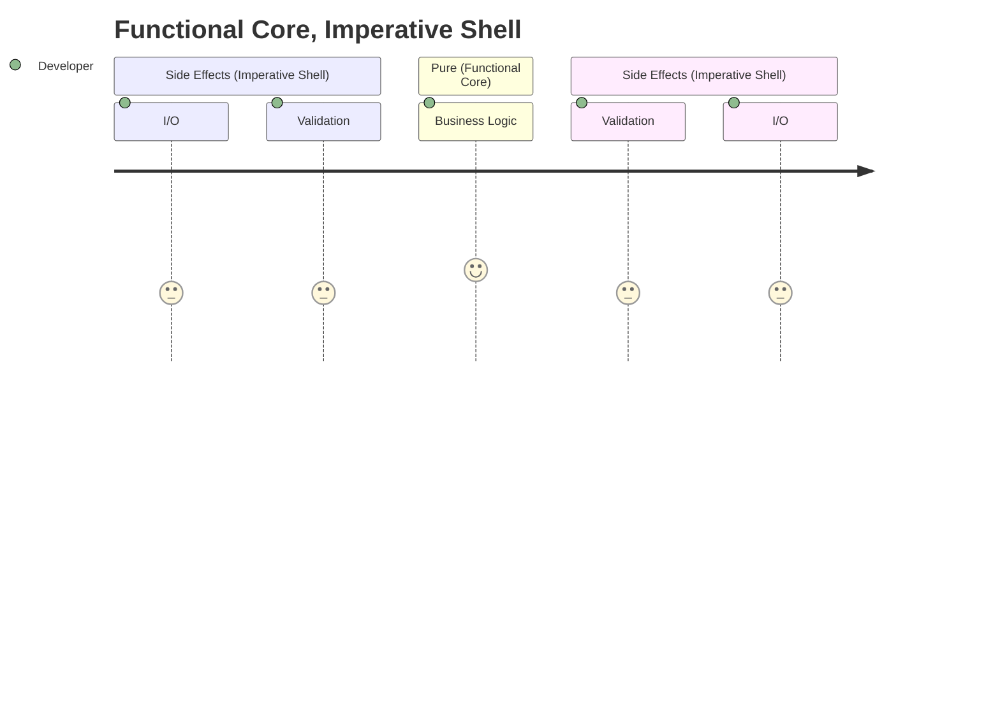

# Code Design

- [Functional Core, Imperative Shell (destroyallsoftware.com)](https://www.destroyallsoftware.com/screencasts/catalog/functional-core-imperative-shell)
- [Robert C Martin - Functional Programming; What? Why? When? (youtube.com)](https://www.youtube.com/watch?v=7Zlp9rKHGD4)
- [Moving IO to the edges of your app: Functional Core, Imperative Shell - Scott Wlaschin (youtube.com)](https://www.youtube.com/watch?v=P1vES9AgfC4)

- [ ] #BUG: enable mermaid

