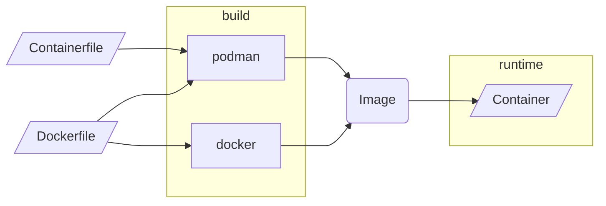

# Docker

<!-- markdownlint-disable-next-line MD026 -->
## Oh my! Docker, Images, Containers!

Let's talk these.

When someone talks about **Docker**, they usually mean **containers** in
general. It is quite likely that they have not used anything else but
the `docker` command or **Docker Desktop**. That is absolutely OK.
Let's clarify some vocabulary:

- ****Container**** that's the thing runs anything you like, a
  webserver, a database server, an email server, ...
- ****Container Image**** this is what you need to create a container.
  You can't think of it like a cookiecutter. You can as many cookie as
  you like, it will always be the same as long as you use the same image
- `Dockerfile` this is what you use to create an image. You do
  ****not**** have to use a **`Dockerfile`**, there are a few options.
  Another option is a general **containerfile**. Systems like podman use
  a containerfile, it is --- *usually* --- compatible with a
  `Dockerfile`.

How does this look?

- [ ] #BUG: Enable `mermaid`

## Prepare your environment

- [ ] #BUG: Add a section about installing other tools
- [ ] #BUG: Rancher Desktop
- [ ] #BUG: Podman Desktop

### Docker Containers

- **Running a container from an existing image**

  - `docker run`
  - `docker run --volume ...`
  - `docker run --volume ... --port ...`
  - `docker run --volume ... --port ... --entrypoint`

- ****Building a container from an existing image****

  - `docker build ...`
  - `docker buildx ...`
