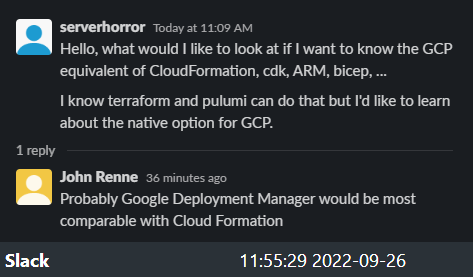

# Google Cloud Platform [GCP]

> Google Cloud Deployment Manager is an infrastructure deployment
> service that automates the creation and management of Google Cloud
> resources. Write flexible template and configuration files and use
> them to create deployments that have a variety of Google Cloud
> services, such as Cloud Storage, Compute Engine, and Cloud SQL,
> configured to work together.
>
> -- [Documentation](https://cloud.google.com/deployment-manager/docs)
