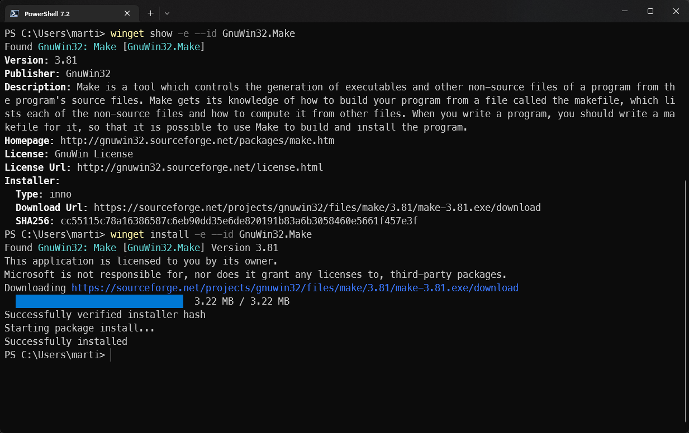
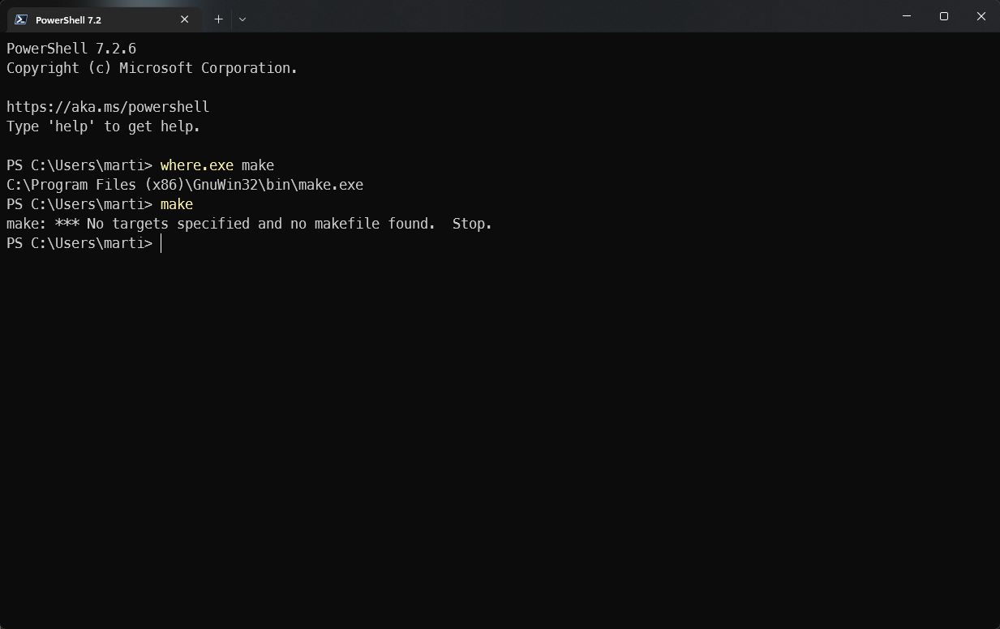
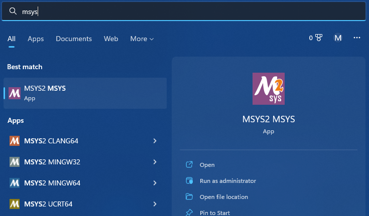
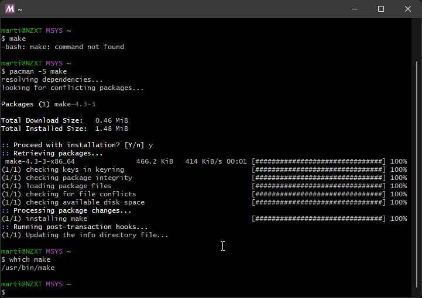

# make on Windows

## GnuWin32

### Running `make` from GnuWin32

- Install _GnuWin32_

  ```text
  winget install -e --id GnuWin32.Make
  winget install -e --id GnuWin32.Grep
  winget install -e --id GnuWin32.Tree
  ```

  

- Run `make` from any `cmd.exe` or _PowerShell_

  - Add the location of `make.exe` to your path

    ```powershell
    [System.Environment]::SetEnvironmentVariable(
      "PATH",
      "${env:ProgramFiles(x86)}\GnuWin32\bin;$env:PATH",
      [System.EnvironmentVariableTarget]::User
      )
    ```

  - To be able to run it you need to restart your current terminal
    This is the usual process to reload new environment variables
    

## MSYS2

MSYS2 is a collection of tools and libraries providing you with an easy-to-use environment for building, installing and running native Windows software.

```text
winget install -e --id msys2.msys2
```

### Running `make` from MSYS2

- Run _MSYS2_ from the start menu
  

- Install make inside of _MSYS2_

  ```text
  pacman -S make
  ```

- Now you can run make

  ```text
  which make
  ```

  
