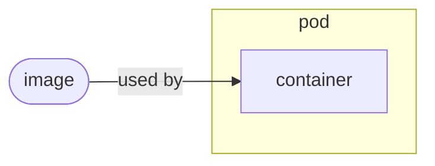
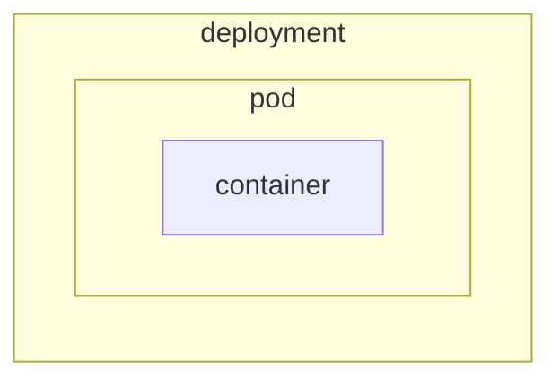

## Kubernetes I*n* Docker [KI*n*D]





## Create a Cluster and look around

1. Get started

    ```text
    kind create cluster
    ```

    output

    ```text
    Creating cluster "kind" ...
    ✓ Ensuring node image (kindest/node:v1.25.0) 🖼
    ✓ Preparing nodes 📦
    ✓ Writing configuration 📜
    ✓ Starting control-plane 🕹️
    ✓ Installing CNI 🔌
    ✓ Installing StorageClass 💾
    Set kubectl context to "kind-kind"
    You can now use your cluster with:

    kubectl cluster-info --context kind-kind

    Have a nice day! 👋
    ```

1. standard `kubectl` commands

    ```text

    ```text
    kubectl cluster-info --context kind-kind
    ```

    output

    ```text
    Kubernetes control plane is running at https://127.0.0.1:56236
    CoreDNS is running at https://127.0.0.1:56236/api/v1/namespaces/kube-system/services/kube-dns:dns/proxy

    To further debug and diagnose cluster problems, use 'kubectl cluster-info dump'.
    ```

    And taking a look at the context

    ```text
    kubectl config current-context
    ```

    output

    ```text
    kind-kind
    ```

## Create our first resource

1. Running things directly

   !!WARN: This is not the recommended way to run things in Kubernetes!!

    ```text
    kubectl run --image gcr.io/google-containers/busybox mypod
    ```

    output

    ```text
    pod/mypod created
    ```

2. Inspect the pod

    ```text
    kubectl get pod
    ```

    output

    ```text
    NAME    READY   STATUS             RESTARTS      AGE
    mypod   0/1     CrashLoopBackOff   1 (12s ago)   16s
    ```

3. Look at "all" the things

    ```text
    kubectl get all
    ```

    output

    ```text
    NAME        READY   STATUS             RESTARTS     AGE
    pod/mypod   0/1     CrashLoopBackOff   1 (3s ago)   7s

    NAME                 TYPE        CLUSTER-IP   EXTERNAL-IP   PORT(S)   AGE
    service/kubernetes   ClusterIP   10.96.0.1    <none>        443/TCP   13m
    ```

![[kubernetes.misc]]
