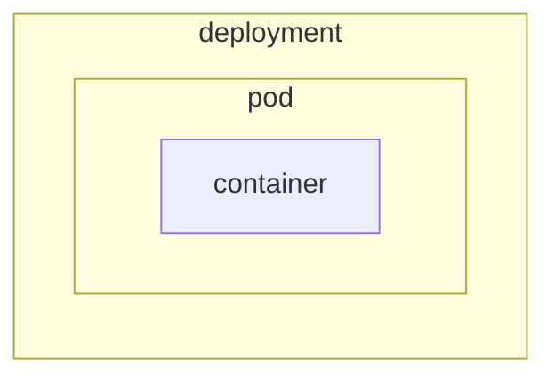

# Kubernetes

## Kubernetes I*n* Docker (KI*n*D)




## Create a Cluster and look around

1. Get started

   ```text
   kind create cluster
   ```

   output

   ```text
   Creating cluster "kind" ...
   ✓ Ensuring node image (kindest/node:v1.25.0) 🖼
   ✓ Preparing nodes 📦
   ✓ Writing configuration 📜
   ✓ Starting control-plane 🕹️
   ✓ Installing CNI 🔌
   ✓ Installing StorageClass 💾
   Set kubectl context to "kind-kind"
   You can now use your cluster with:

   kubectl cluster-info --context kind-kind

   Have a nice day! 👋
   ```

1. standard `kubectl` commands

   ````text

   ```text
   kubectl cluster-info --context kind-kind
   ````

   output

   ```text
   Kubernetes control plane is running at https://127.0.0.1:56236
   CoreDNS is running at https://127.0.0.1:56236/api/v1/namespaces/kube-system/services/kube-dns:dns/proxy

   To further debug and diagnose cluster problems, use 'kubectl cluster-info dump'.
   ```

   And taking a look at the context

   ```text
   kubectl config current-context
   ```

   output

   ```text
   kind-kind
   ```

## Create our first resource

1. Running things directly

   !!WARN: This is not the recommended way to run things in Kubernetes!!

   ```text
   kubectl run --image gcr.io/google-containers/busybox mypod
   ```

   output

   ```text
   pod/mypod created
   ```

2. Inspect the pod

   ```text
   kubectl get pod
   ```

   output

   ```text
   NAME    READY   STATUS             RESTARTS      AGE
   mypod   0/1     CrashLoopBackOff   1 (12s ago)   16s
   ```

3. Look at "all" the things

   ```text
   kubectl get all
   ```

   output

   ```text
   NAME        READY   STATUS             RESTARTS     AGE
   pod/mypod   0/1     CrashLoopBackOff   1 (3s ago)   7s

   NAME                 TYPE        CLUSTER-IP   EXTERNAL-IP   PORT(S)   AGE
   service/kubernetes   ClusterIP   10.96.0.1    <none>        443/TCP   13m
   ```

### _Alternative_ — Windows Hyper-V

A _Hyper_-what-now?

Big words! It's a piece like VMWare, VirtualBox, Hyper-V — which is built into Windows

- [Hyper-V on Windows][hyper-v-on-windows]

```powershell
Enable-WindowsOptionalFeature -Online -FeatureName Microsoft-Hyper-V -All
```

output

```text
Path          :
Online        : True
RestartNeeded : False
```

### _Alternative_ — Install `minikube`

- Follow the instructions in [minikube start][minikube-start]
- Download `minikube.exe`

  ```powershell
  New-Item -Path 'c:\' -Name 'minikube' -ItemType Directory -Force
  Invoke-WebRequest -OutFile 'c:\minikube\minikube.exe' -Uri 'https://github.com/kubernetes/minikube/releases/latest/download/minikube-windows-amd64.exe' -UseBasicParsing
  ```

- Add the executable to your path

  ```powershell
  $oldPath = [Environment]::GetEnvironmentVariable('Path', [EnvironmentVariableTarget]::User)
  if ($oldPath.Split(';') -inotcontains 'C:\minikube'){ `
    [Environment]::SetEnvironmentVariable('Path', $('C:\minikube;{0}' -f $oldPath), [EnvironmentVariableTarget]::User) `
  }
  ```

- Reload your path.
  The easiest way is to stop and start your terminal again.

  If you use VS Code do not use _Developer: Reload Window_. You will need to close and open the full application.

  

  The same applies other tools like JetBrains products if you use them.

  ```powershell
  Get-Command minikube
  ```

  Output

  ```text
  CommandType     Name                                               Version    Source
  -----------     ----                                               -------    ------
  Application     minikube.exe                                       0.0.0.0    C:\minikube\minikube.exe
  ```

## Kubernetes CPU limits


## How to start a Pod

```bash
kubectl run nginx --image=nginx
```

## How to delete a Pod

```bash
kubectl delete pod nginx
```

## How to get a Pod

```bash
kubectl get pod nginx
```

[minikube-start]: https://minikube.sigs.k8s.io/docs/start/
[hyper-v-on-windows]: https://learn.microsoft.com/en-us/virtualization/hyper-v-on-windows/quick-start/enable-hyper-v
