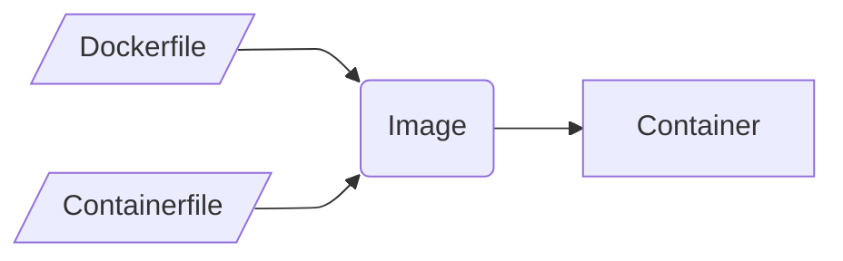

## Oh my! 💀 Docker, Images, Containers

Let's talk these.

When someone talks about _Docker_, they usually mean _containers_ in general.
It is quite likely that they have not used anything else but the `docker` command or _Docker Desktop_.
That is absolutely OK.
Let's clarify some vocabulary:

* **Container** — that's the thing runs anything you like, a webserver, a database server, an email server, …
* **Container Image** — this is what you need to create a container.
  You can't think of it like a cookiecutter.
  You can as many cookie as you like, it will always be the same as long as you use the same image
* **`Dockerfile`** — this is what you use to create an image.
  You do **not** have to use a _"`Dockerfile`"_, there are a few options.
  Another options is a general _containerfile_.
  Systems like podman use a containerfile, it is — usually — compatible with a `Dockerfile`.

How does this look?

## Prepare your environment

### Make sure you have a Hypervisor installed

#### Docker

---

* [Misc](docker.misc.md)
