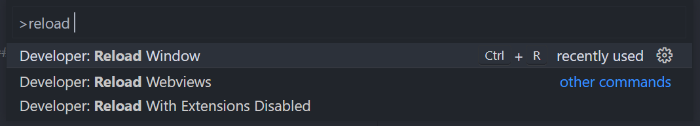

#### *Alternative* — Windows Hyper-V

A *Hyper*-what-now?

Big words! It's a piece like VMWare, VirtualBox, Hyper-V — which is built into Windows

* [Hyper-V on Windows][hyper-v-on-windows]

```powershell
Enable-WindowsOptionalFeature -Online -FeatureName Microsoft-Hyper-V -All
```

output

```text
Path          :
Online        : True
RestartNeeded : False
```

### Install `kind`

### *Alternative* — Install `minikube`

* Follow the instructions in [minikube start][minikube-start]
* Download `minikube.exe`

  ```powershell
  New-Item -Path 'c:\' -Name 'minikube' -ItemType Directory -Force
  Invoke-WebRequest -OutFile 'c:\minikube\minikube.exe' -Uri 'https://github.com/kubernetes/minikube/releases/latest/download/minikube-windows-amd64.exe' -UseBasicParsing
  ```

* Add the executable to your path

  ```powershell
  $oldPath = [Environment]::GetEnvironmentVariable('Path', [EnvironmentVariableTarget]::User)
  if ($oldPath.Split(';') -inotcontains 'C:\minikube'){ `
    [Environment]::SetEnvironmentVariable('Path', $('C:\minikube;{0}' -f $oldPath), [EnvironmentVariableTarget]::User) `
  }
  ```

* Reload your path.
  The easiest way is to stop and start your terminal again.

  If you use VS Code do not use *Developer: Reload Window*. You will need to close and open the full application.

  

  The same applies other tools like JetBrains products if you use them.

  ```powershell
  Get-Command minikube
  ```

  Output

  ```text
  CommandType     Name                                               Version    Source
  -----------     ----                                               -------    ------
  Application     minikube.exe                                       0.0.0.0    C:\minikube\minikube.exe
  ```

---

[minikube-start]: https://minikube.sigs.k8s.io/docs/start/
[hyper-v-on-windows]: https://learn.microsoft.com/en-us/virtualization/hyper-v-on-windows/quick-start/enable-hyper-v
