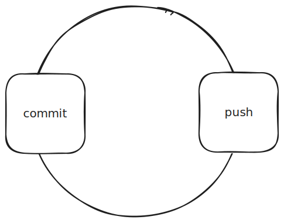

## Attendees

<!-- Meeting attendees. If you prefix users with an '@', you can then optionally click Ctrl+Enter to create a note for that user. -->

- [[people.sergej-dechant]]

## Goals

<!-- Main objectives of the meeting -->

## Agenda

<!-- Agenda to be covered in the meeting -->

## Minutes

<!-- Notes of discussion occurring during the meeting -->

## Action Items

<!-- You can add any follow up items here. If they require more detail, you can use `Create Task Note` to create each follow up item as a separate note. -->

- Follow Up Task 1
- Follow Up Task 2
