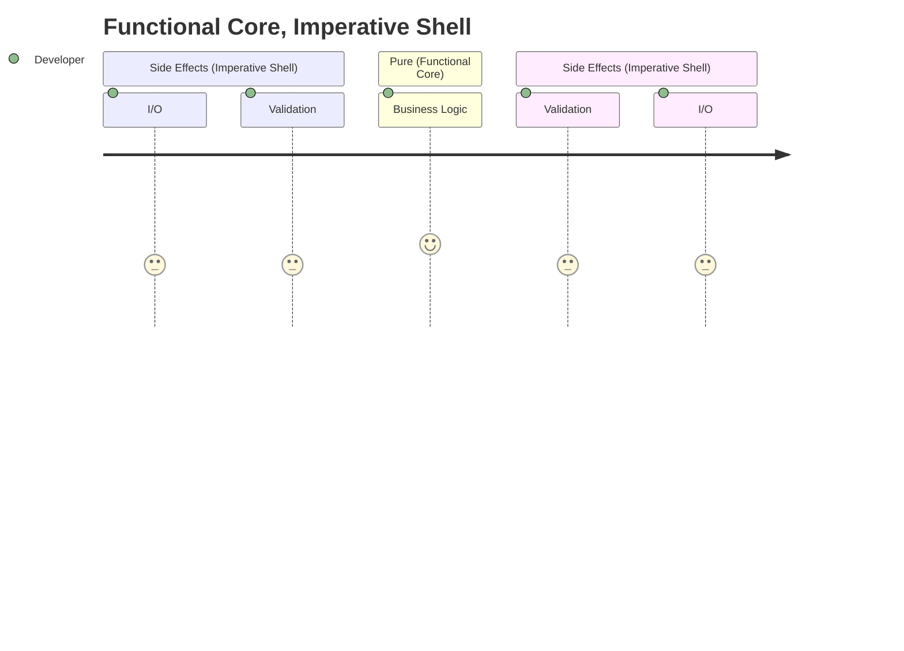

## Code Design

> Functional Core, Imperative Shell
* [Functional Core, Imperative Shell (destroyallsoftware.com)](https://www.destroyallsoftware.com/screencasts/catalog/functional-core-imperative-shell)
* [Robert C  Martin -  Functional Programming; What? Why? When? (youtube.com)](https://www.youtube.com/watch?v=7Zlp9rKHGD4)
* [Moving IO to the edges of your app: Functional Core, Imperative Shell - Scott Wlaschin (youtube.com)](https://www.youtube.com/watch?v=P1vES9AgfC4)




## Install Visual Studio 2022 Build Tools

* [Visual Studio workload and component IDs](https://learn.microsoft.com/en-us/visualstudio/install/workload-and-component-ids?view=vs-2022)
* [Use command-line parameters to install Visual Studio](https://learn.microsoft.com/en-us/visualstudio/install/use-command-line-parameters-to-install-visual-studio?view=vs-2022)
  * [Use command-line parameters to install Visual Studio](https://learn.microsoft.com/en-us/visualstudio/install/use-command-line-parameters-to-install-visual-studio?view=vs-2022#use-winget-to-install-or-modify-visual-studio)

```powershell
winget install -e `
  --id Microsoft.VisualStudio.2022.BuildTools `
  --override "--wait --quiet --add ProductLang En-us --add Microsoft.VisualStudio.Workload.NativeDesktop --includeRecommended"
```

## Jenkins Snippets


```groovy
// This was the only script that allowed me to see the zombie job
jenkins.model.Jenkins.instance.computers.collect { c -> c.executors }.collectMany { it.findAll { it.isBusy () } }.each { it -> println(it.getName()); }

//Try to stop it but didnt work
jenkins.model.Jenkins.instance.computers.collect { c -> c.executors }.collectMany { it.findAll { it.isBusy () } }.each { it.stop () }
```

```groovy
Jenkins.instance.getItemByFullName("example-folder/example-job-name").getBuildByNumber(69).finish(hudson.model.Result.ABORTED, new java.io.IOException("Aborting build"));
```

```groovy
Jenkins.instance.getItemByFullName("example-folder/example-job-name").getBuildByNumber(420).finish(hudson.model.Result.ABORTED, new java.io.IOException("Aborting build"));
```
