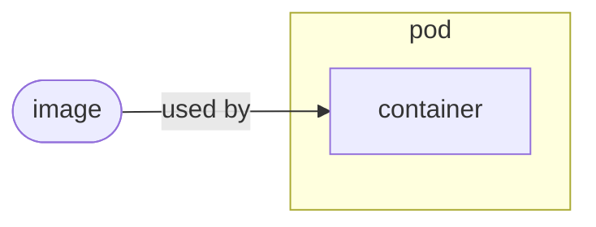
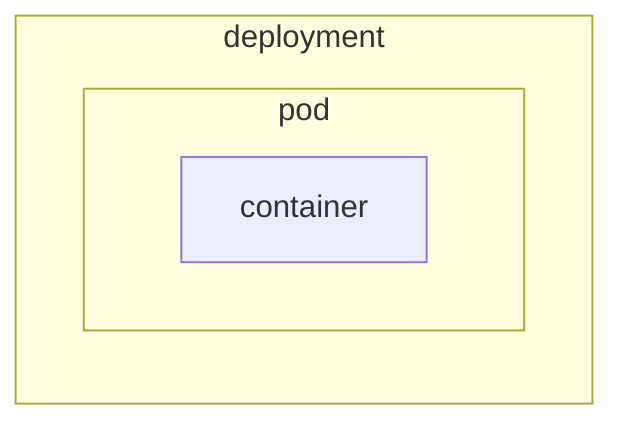

# Kubernetes

## Kubernetes I*n* Docker (KI*n*D)





We can easily create a cluster using [[kubernetes-kind-cluster]].

To create simple (trivial) resources you can use `kubectl` directly.
For a complete example look at [[kubernetes-create-simple-resource]]

### _Alternative_ — Install `minikube`

- Follow the instructions in [minikube start][minikube-start]
- Download `minikube.exe`

  ```powershell
  New-Item -Path 'c:\' -Name 'minikube' -ItemType Directory -Force
  Invoke-WebRequest -OutFile 'c:\minikube\minikube.exe' -Uri 'https://github.com/kubernetes/minikube/releases/latest/download/minikube-windows-amd64.exe' -UseBasicParsing
  ```

- Add the executable to your path

  ```powershell
  $oldPath = [Environment]::GetEnvironmentVariable('Path', [EnvironmentVariableTarget]::User)
  if ($oldPath.Split(';') -inotcontains 'C:\minikube'){ `
    [Environment]::SetEnvironmentVariable('Path', $('C:\minikube;{0}' -f $oldPath), [EnvironmentVariableTarget]::User) `
  }
  ```

- Reload your path.
  The easiest way is to stop and start your terminal again.

  If you use VS Code do not use _Developer: Reload Window_. You will need to close and open the full application.

  

  The same applies other tools like JetBrains products if you use them.

  ```powershell
  Get-Command minikube
  ```

  Output

  ```text
  CommandType     Name                                               Version    Source
  -----------     ----                                               -------    ------
  Application     minikube.exe                                       0.0.0.0    C:\minikube\minikube.exe
  ```

## Kubernetes CPU limits


## How to start a Pod

```bash
kubectl run nginx --image=nginx
```

## How to delete a Pod

```bash
kubectl delete pod nginx
```

## How to get a Pod

```bash
kubectl get pod nginx
```

[minikube-start]: https://minikube.sigs.k8s.io/docs/start/


[//begin]: # "Autogenerated link references for markdown compatibility"
[kubernetes-kind-cluster]: kubernetes-kind-cluster "Kubernetes - Create KiND Cluster"
[kubernetes-create-simple-resource]: kubernetes-create-simple-resource "Kubernetes - Create a Simple Resource"
[//end]: # "Autogenerated link references"
